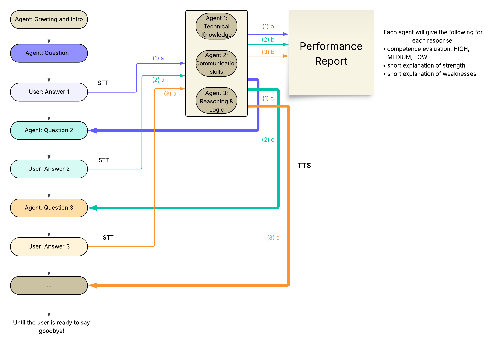

# Interview Practice Agent with Cartesia and Cerebras

A real-time interviewer voice agent integrating Cerebras (via LiteLLM) and Cartesia Line SDK v0.2.



## Architecture

This example demonstrates a multi-agent architecture:

- **InterviewAgent**: Main conversation agent using `LlmAgent` with `cerebras/llama3.3-70b`
- **BackgroundJudges**: Three silent analysis agents using `LlmAgent` with `cerebras/llama3.1-8b`
  - Technical Report: Evaluates technical expertise
  - Communication Report: Evaluates communication skills
  - Reasoning Report: Evaluates logical thinking

The background judges run in parallel on each user turn (after the interview starts) and write their evaluations to the `reports/` folder.

## Getting Started

### Prerequisites

- A [Cerebras API Key](https://cloud.cerebras.ai/)
- A [Cartesia](https://play.cartesia.ai/agents) account and API key

1) Install the Cartesia CLI tool:

```bash
curl -fsSL https://cartesia.sh | sh
```

2) Install python dependencies:

```bash
# uv (recommended)
uv sync
# or with pip
pip install -e .
```

### Running Locally
1) Add your API keys to a `.env` file:

```
CEREBRAS_API_KEY=your-cerebras-key
```

2) Run the agent locally:
```bash
python main.py
```

## File Structure

| File | Description |
|------|-------------|
| `main.py` | Entry point with `get_agent()` callback |
| `interviewer.py` | `InterviewAgent` class wrapping `LlmAgent` |
| `judges.py` | `BackgroundJudge` class for silent analysis |
| `config.py` | Model IDs, prompts, and schemas |
| `report_logger.py` | Simple file logger for judge reports |
| `cartesia.toml` | Deployment configuration |

## How It Works

1. **Call Starts**: Agent introduces itself and asks about the role
2. **User Ready**: When user confirms, agent calls `start_interview` tool
3. **Interview Loop**:
   - User responds to questions
   - Background judges analyze each response (fire-and-forget)
   - Agent asks follow-up questions
4. **Call Ends**: User says goodbye, agent calls `end_call` tool

## Key v0.2.0 Patterns

### Agent Wrapper Pattern

```python
class InterviewAgent(AgentClass):
    def __init__(self):
        self._agent = LlmAgent(
            model="cerebras/llama3.3-70b",
            tools=[end_call, self.start_interview],
            config=LlmConfig(...),
        )

    async def process(self, env: TurnEnv, event: InputEvent) -> AsyncIterable[OutputEvent]:
        # Custom logic before/after LlmAgent
        async for output in self._agent.process(env, event):
            yield output
```

### Instance Method as Tool

```python
@loopback_tool
async def start_interview(self, ctx: ToolEnv, confirmed: Annotated[bool, "..."]) -> str:
    self._interview_started = confirmed  # Update instance state
    return "Interview started."
```

### Background Analysis with LlmAgent

```python
class BackgroundJudge:
    def __init__(self, system_prompt: str):
        self._agent = LlmAgent(
            model="cerebras/llama3.1-8b",
            config=LlmConfig(
                system_prompt=system_prompt,
                extra={"response_format": {...}},  # Structured output
            ),
        )

    async def analyze(self, env: TurnEnv, history: List):
        # Create synthetic event to pass history
        event = UserTurnEnded(content=[...], history=history)

        # Consume but don't yield output events
        async for output in self._agent.process(env, event):
            if isinstance(output, AgentSendText):
                # Parse and log, don't yield
                pass
```

## Deploying to Cartesia

1) Upload API keys to Cartesia:

```bash
cartesia env set CEREBRAS_API_KEY your-cerebras-key
```

2) Deploy the agent:

```
cartesia deploy
```
