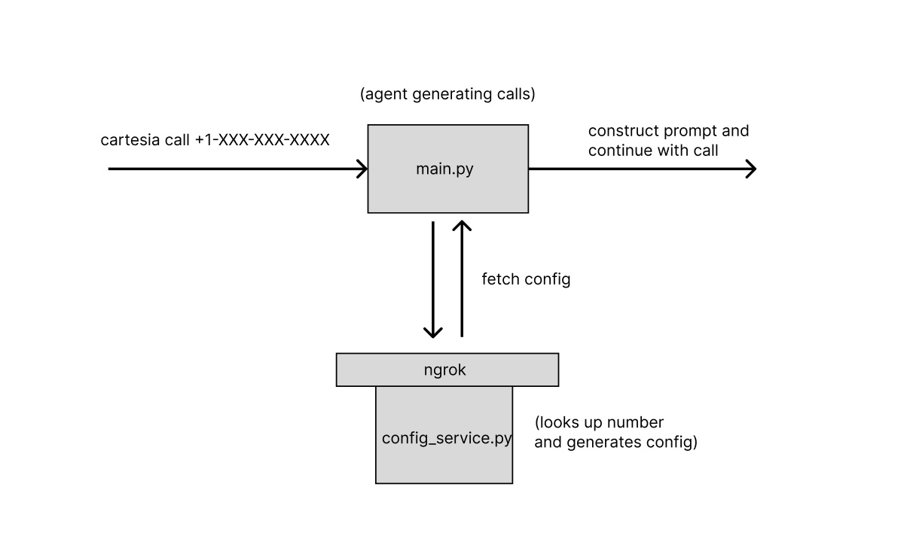

# SMB Business Outbound Agent

This is an example of a voice agent that outbounds small business to ask a series of questions from them.

This is a single prompt agent that handles direct pickup, IVR and voicemail. If it reaches a human, it will ask a simple questionaire. In this case, it will try to confirm the name and address.

In this example, we call a ski shop to confirm address and see if they have gear available or not.

## Problem

When you call a small business, one of three things will happen:

| Outcome       | Description                            | Expected Agent Behavior |
| ------------- | -------------------------------------- | ----------------------  |
| Direct Pickup | someone at the front desk will pick up | Begin the questionaire  |
| IVR           | the business has a phone tree          | Select the best option  |
| Voicemail     | we're calling when they are closed     | end the call            |


## System diagram and quickstart

This example also features a callback to an external URL to determine the call parameters (config_service.py).



To test this template:

1. Make sure you have a gemini api key
```
export GEMINI_API_KEY=<your-gemini-api-key>
```

2. Start engrok

```
ngrok http http://localhost:8001
```

3. Modify the ngrok url in config.py

```
# cat config.py
...
CONFIG_URL = "https://your-domain.com/callback"
...
```

4. Modify the config service to contain your phone number (you will use this for testing in step 7)

```
CONFIG = """
Test name | 123 anything street | your-phone-number
"""
```

5. Start config_service

```
uv run config_service.py
```

6. To test locally:

    i. Start your agent with `main.py`
    ```
    uv run main.py
    ```

    ii. Chat with your agent to make sure it works locally
    ```
    cartesia chat
    ```

    iii. You should see config_service.py receive a request

    ```
    INFO:     10.12.34.567:0 - "POST /details HTTP/1.1" 200 OK
    ```

    iv. Note that if a number is not found, the existing service is configured to return a default configuration.

7. When you are satisfied with your agent, deploy your agent

```
cartesia init               # Select create a new agent

cartesia deploy             # deploys the current project

cartesia env set GEMINI_API_KEY=$GEMINI_API_KEY     # sets the gemini api key
```

8. Test your agent with your phone number
```
cartesia call +1XXXXXXXXXX
```

When you speak with it, it should address you with the configuration you set in step 3
